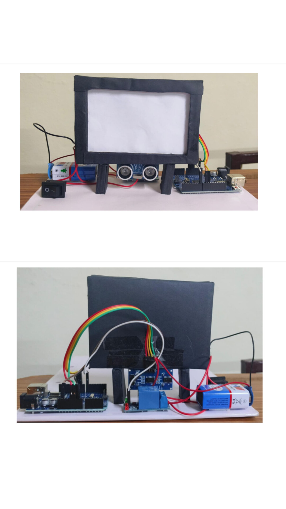

# Smart Proximity TV System for Child Safety

## 📖 Overview
This project is designed to protect children from sitting too close to the television. It uses a proximity sensor to monitor the distance between the child and the TV. If the distance becomes unsafe, the system alerts the user.

## ⚙️ Features
- Monitors distance between user and TV  
- Alerts when distance is too close  
- Helps prevent eye strain  
- Simple and low-cost system  

## 🛠️ Technologies Used
- Arduino / C++  
- Ultrasonic Sensor (HC-SR04)  
- Buzzer / LED  

## 🔄 Working
The ultrasonic sensor (HC-SR04) measures the distance between the child and the TV in real time.  
If the distance falls below a predefined safe limit (e.g., 50 cm), the system activates a buzzer or LED to alert the user to move back.
## Circuit 

## Components Required 
- Arduino UNO
- HC-SRO4 Ultrasonic sensor
- Buzzer
- Jumper wires
- Breadboard
## Code Output
- 
## Demo Video
- [Watch demo on Youtube](https://youtu.be/C8GWi3mseis?si=c8QGTviNQ2GiOta6)
## 🚀 Future Improvements
- Mobile app alerts  
- Camera-based detection  
- AI-based monitoring  

## 👨‍💻 Author
Rollu Akshara
